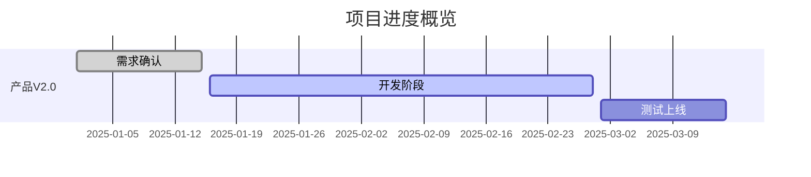
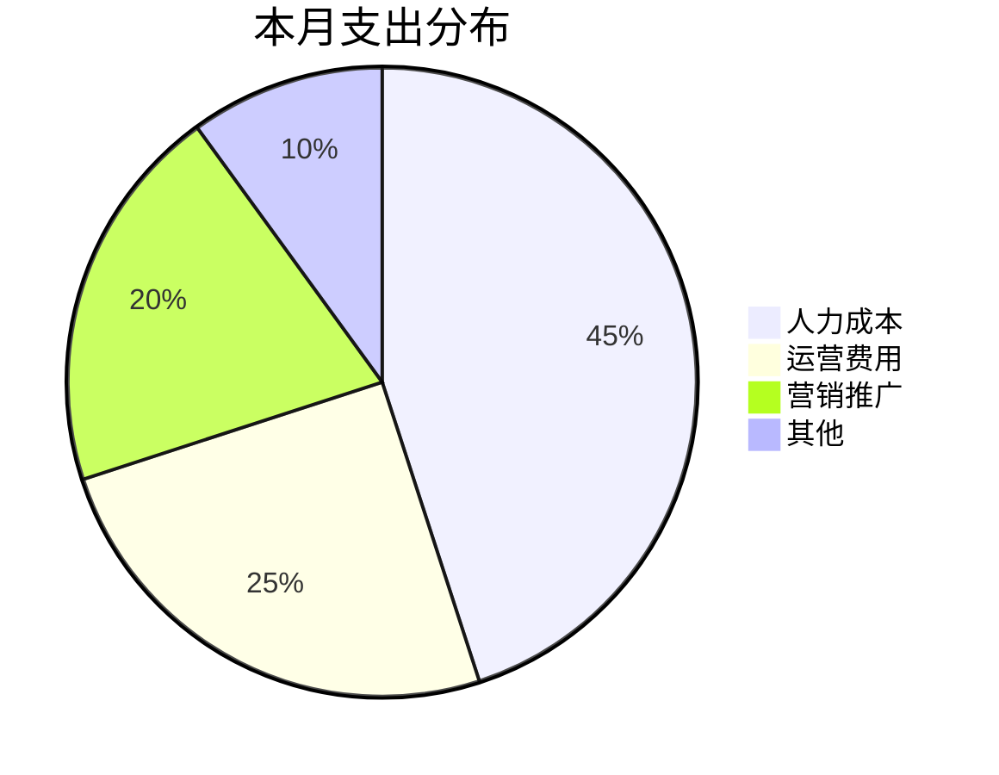

# CEO Dashboard 数据模板与输出示例

## 1. 财务模块数据结构

```yaml
finance:
  period: "2025-01-W4"  # 周期
  cash_flow:
    opening_balance: 100000
    income:
      - source: "客户A付款"
        amount: 50000
      - source: "客户B付款"
        amount: 30000
    expenses:
      - category: "人力成本"
        amount: 40000
      - category: "运营费用"
        amount: 15000
    closing_balance: 125000
  budget_vs_actual:
    revenue:
      budget: 100000
      actual: 80000
      variance: -20%
    cost:
      budget: 60000
      actual: 55000
      variance: -8%
```

**财务输出示例**:
```markdown
## 财务概览 (2025-01-W4)

### 现金流
| 项目 | 金额 |
|------|------|
| 期初余额 | ¥100,000 |
| 本期收入 | ¥80,000 |
| 本期支出 | ¥55,000 |
| 期末余额 | ¥125,000 |

### 预算执行
- 收入完成率: 80% (¥80K/¥100K) ⚠️
- 成本控制: 92% (¥55K/¥60K) ✅
```

## 2. 项目模块数据结构

```yaml
projects:
  - name: "产品V2.0开发"
    status: "on_track"  # on_track | at_risk | delayed | completed
    progress: 65%
    owner: "张三"
    milestones:
      - name: "需求确认"
        due: "2025-01-15"
        status: "completed"
      - name: "开发完成"
        due: "2025-02-28"
        status: "in_progress"
    risks:
      - "后端开发资源紧张"
    next_actions:
      - "本周完成API开发"
```

**项目状态可视化** (Mermaid):


## 3. OKR/KPI 模块数据结构

```yaml
okr:
  period: "2025-Q1"
  objectives:
    - objective: "扩大海外市场份额"
      progress: 40%
      key_results:
        - kr: "新增3个海外经销商"
          target: 3
          actual: 1
          progress: 33%
        - kr: "海外收入达到100万"
          target: 1000000
          actual: 350000
          progress: 35%
    - objective: "提升产品质量"
      progress: 70%
      key_results:
        - kr: "客户投诉率降至1%以下"
          target: "1%"
          actual: "0.8%"
          progress: 100%
```

**OKR 输出示例**:
```markdown
## OKR 进度 (2025-Q1)

### O1: 扩大海外市场份额 (40%)
█████░░░░░░░░░░░░░░░ 40%

| KR | 目标 | 实际 | 进度 |
|----|------|------|------|
| 新增海外经销商 | 3家 | 1家 | 33% ⚠️ |
| 海外收入 | ¥100万 | ¥35万 | 35% ⚠️ |

### O2: 提升产品质量 (70%)
██████████████░░░░░░ 70%
```

## 4. 团队模块数据结构

```yaml
team:
  total_headcount: 25
  departments:
    - name: "研发"
      count: 12
    - name: "销售"
      count: 8
    - name: "运营"
      count: 5
  changes:
    - type: "join"
      name: "李四"
      department: "研发"
      date: "2025-01-20"
  key_positions:
    - role: "技术总监"
      status: "filled"
    - role: "海外销售经理"
      status: "recruiting"
```

## 5. 风险登记数据结构

```yaml
risks:
  - id: "R001"
    description: "核心开发人员离职风险"
    category: "人力资源"
    likelihood: "medium"  # low | medium | high
    impact: "high"
    mitigation: "知识文档化、备份人员培养"
    owner: "HR总监"
    status: "monitoring"
```

**风险矩阵输出**:
```
        │ 低影响  │ 中影响  │ 高影响
────────┼─────────┼─────────┼─────────
高可能性│         │         │ ⚠️
中可能性│         │  R002   │  R001
低可能性│  R003   │         │
```

## 6. 决策记录数据结构

```yaml
decisions:
  - id: "D001"
    date: "2025-01-20"
    topic: "是否参加3月份广交会"
    context: "展位费用15万，预期获取50个询盘"
    options:
      - "参展（15万预算）"
      - "不参展，资金用于线上推广"
    decision: "参展"
    rationale: "品牌曝光+直接接触客户的机会难以替代"
    action_items:
      - "本周确认展位"
      - "准备展品和宣传资料"
    decided_by: "CEO"
```

## 7. 周报输出示例

```markdown
# 管理层周报 (2025-01-W4)

## 本周要点
- ✅ [完成] 产品V2.0需求评审
- ⚠️ [关注] 现金流本月偏紧
- 🚀 [进展] 新签客户2家

## 财务快照
[现金流 + 预算执行摘要]

## 项目状态
[各项目一行摘要]

## OKR 进度
[目标完成度条形图]

## 风险与问题
[Top 3 风险]

## 下周计划
[关键行动项]
```

## 8. Dashboard 图表示例（Mermaid）


