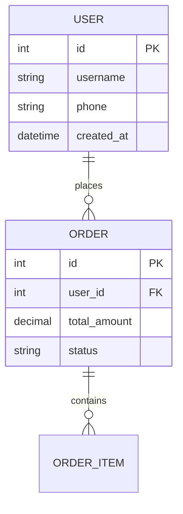

# 代码架构分析器 (逆向)

## Overview

从现有代码仓库逆向分析应用架构，生成结构化的架构分析文档。与 `tech-architecture`（正向设计）相反，本 skill 从代码出发推导架构。

```
1. 扫描项目结构
2. 识别技术栈和组件
3. 分析模块依赖关系
4. 追踪数据流和 API 调用
5. 生成架构分析文档
```

## 工作流程

### Step 1: 项目结构扫描

```bash
# 扫描项目根目录
ls -la

# 识别典型目录结构
find . -maxdepth 2 -type d | head -30

# 统计代码量
find . -name "*.ts" -o -name "*.js" -o -name "*.py" -o -name "*.java" -o -name "*.go" | wc -l
```

### Step 2: 技术栈识别

| 目录/文件 | 可能的技术 |
|----------|----------|
| `package.json`, `src/` | Node.js/前端 |
| `pom.xml`, `src/main/java/` | Java |
| `requirements.txt`, `*.py` | Python |
| `go.mod`, `*.go` | Go |
| `docker/`, `Dockerfile` | 容器化 |
| `k8s/`, `helm/` | Kubernetes |
| `terraform/` | IaC |
| `serverless.yml` | Serverless |

### Step 3: 架构层次分析

#### 前端识别

```bash
# 检查前端目录
ls -la frontend/ front/ client/ web/ ui/ 2>/dev/null || echo "无明确前端目录"

# 检查根目录是否有前端代码
ls -la src/ | grep -E "(App|main|index|components|pages)"
```

**识别指标**：
- `package.json` + `src/`
- `webpack.config.js`, `vite.config.js`
- `components/`, `pages/`, `views/`
- 框架特征：React, Vue, Angular

#### 后端识别

```bash
# 检查后端目录
ls -la backend/ server/ api/ service/ 2>/dev/null || echo "无明确后端目录"

# 检查特定框架结构
ls -la src/main/java/  # Spring Boot
ls -la src/ | grep -E "(controller|service|repository|model)"
```

**识别指标**：
- Java: `pom.xml`, `build.gradle`, `src/main/java/`
- Node.js: `package.json` + `server/`, `api/`
- Python: `requirements.txt`, `app.py`, `main.py`
- Go: `go.mod`, `main.go`, `internal/`

#### Infrastructure 识别

```bash
# 检查基础设施配置
find . -maxdepth 3 -name "docker-compose.yml" -o -name "Dockerfile" -o -name "*.tf" -o -name "k8s" -type d
```

### Step 4: 模块分析

#### 依赖关系分析

**Node.js/前端**：
```bash
# 分析 package.json 依赖
cat package.json | jq '.dependencies, .devDependencies'

# 分析内部模块导入（示例）
grep -r "import.*from.*\.\.\/" src/ | head -20
```

**Java (Spring Boot)**：
```bash
# 分析 Maven 模块
cat pom.xml | grep "<module>"

# 分析包结构
find src/main/java -type d | sed 's|src/main/java/||' | grep -v "^src"
```

**Python**：
```bash
# 分析导入关系
grep -r "^import \|^from " backend/ | head -30
```

#### API 调用分析

```bash
# 查找 HTTP 请求
grep -r "fetch\|axios\|request\|http\.get\|@GetMapping\|@PostMapping" . --include="*.ts" --include="*.js" --include="*.java" --include="*.py" | head -20

# 查找 API 定义
grep -r "@RequestMapping\|@app\.\|router\." . --include="*.java" --include="*.py" --include="*.ts" | head -20
```

### Step 5: 数据流追踪

```bash
# 追踪数据库调用
grep -r "SELECT\|INSERT\|UPDATE\|db\.\|query\|execute" . --include="*.sql" --include="*.py" --include="*.java" --include="*.ts" | head -20

# 查找模型/实体定义
find . -name "*model*" -o -name "*entity*" -o -name "*schema*" | grep -E "\.(py|java|ts|js)$"
```

### Step 6: 业务流程分析（必须）

从代码中识别核心业务链路，梳理主要用户操作路径。

```bash
# 查找路由/控制器中的业务入口
grep -r "function do\|function action\|case '\|route(" . --include="*.php" --include="*.py" --include="*.java" --include="*.ts" | head -30

# 查找订单/支付/用户等核心业务关键词
grep -r "order\|payment\|checkout\|register\|login\|refund\|ship" . --include="*.php" --include="*.py" --include="*.java" | head -30

# 查找状态机/流程流转
grep -r "status.*=\|state.*=\|->status\|\.status" . --include="*.php" --include="*.py" --include="*.java" | head -20
```

**输出要求**：
- 识别 3-5 条核心业务链路（如：用户注册→浏览商品→下单→支付→发货→收货→售后）
- 使用 Mermaid `flowchart TD` 或 `sequenceDiagram` 绘制
- 标注每个环节涉及的模块/表/外部服务
- 输出到 `business-flow.md` + `diagrams/business-flow.mmd`

### Step 7: API 接口梳理（必须）

从代码中扒出所有 API 端点，生成接口清单。

```bash
# PHP 路由
grep -r "Route::\|->get(\|->post(\|->put(\|->delete(" . --include="*.php" | head -30

# 查找 Controller 方法
grep -r "function do\|function action\|@GetMapping\|@PostMapping\|@RequestMapping" . --include="*.php" --include="*.java" | head -30

# RESTful API
grep -r "router\.\(get\|post\|put\|delete\)\|app\.\(get\|post\|put\|delete\)" . --include="*.js" --include="*.ts" | head -30

# 查找 API 返回格式
grep -r "json_encode\|JsonResponse\|return.*response\|res\.json" . --include="*.php" --include="*.java" --include="*.ts" | head -20
```

**输出要求**：
- 按模块/功能分组列出所有接口
- 每个接口包含：路径、HTTP 方法、参数说明、返回值、所属模块
- 标注认证要求（公开/登录/管理员）
- 输出到 `api-inventory.md`

### Step 8: 定时任务识别（必须）

扫描所有定时任务、队列 worker、调度脚本。

```bash
# crontab
crontab -l 2>/dev/null
cat /etc/crontab 2>/dev/null

# 框架调度器
grep -r "schedule\|cron\|artisan\|celery\|@scheduled" . --include="*.php" --include="*.py" --include="*.java" --include="*.yml" | head -20

# 定时脚本
find . -name "*.sh" -o -name "cron*" -o -name "*task*" -o -name "*schedule*" -o -name "*worker*" | head -20

# 宝塔/面板定时任务
cat /www/server/cron/*.sh 2>/dev/null | head -20
```

**输出要求**：
- 列出所有定时任务：任务名、执行周期、脚本路径、功能说明、是否关键
- 即使未发现定时任务也要声明"未发现定时任务"
- 输出到 `cron-tasks.md`

### Step 9: 配置文件分析（必须）

识别所有关键配置文件，梳理配置项。

```bash
# 查找配置文件
find . -name "*.env*" -o -name "config.*" -o -name "*.yml" -o -name "*.yaml" -o -name "*.ini" -o -name "*.conf" -o -name "settings.*" | grep -v node_modules | grep -v vendor | head -20

# 查找环境变量引用
grep -r "getenv\|env(\|os\.environ\|process\.env\|ENV\[" . --include="*.php" --include="*.py" --include="*.js" --include="*.ts" | head -20

# 查找硬编码的连接字符串/密钥
grep -r "password\|secret\|api_key\|token\|host.*=\|port.*=" . --include="*.php" --include="*.py" --include="*.env*" --include="config.*" | head -20
```

**输出要求**：
- 列出每个配置文件及其用途
- 每个关键配置项：名称、用途、是否敏感、迁移时是否需要修改
- 敏感值用 `***` 遮蔽
- 输出到 `config-guide.md`

### Step 10: 已知坑和注意事项（推荐）

汇总分析过程中发现的所有异常、不一致、风险点。

**检查项**：
- 命名不一致（数据库名、表名、变量名等）
- 硬编码路径/IP/域名
- 密钥泄露风险（代码中的明文密钥）
- 版本过旧的依赖/框架
- 废弃/死代码
- 缺少错误处理的关键路径
- 数据库缺少索引的高频查询
- 潜在的安全漏洞（SQL注入、XSS等）

**输出要求**：
- 按严重程度排序：Critical / High / Medium / Low
- 每条包含：问题描述、影响范围、文件位置、建议处理方式
- 标准模式和深度模式必须生成，快速模式可选
- 输出到 `known-issues.md`

### Step 11: 生成架构分析文档

生成涵盖以下章节的 Markdown 文档：项目概览（名称/类型/语言/代码量）、架构分层（前端/后端/Infrastructure 技术栈和模块结构）、模块依赖关系、数据流分析（前端→API→数据库、外部服务调用）、技术栈总览表、架构图（系统架构+部署架构 Mermaid 图）、设计模式识别、潜在问题和建议、技术债务评估。

> **完整文档模板**（含所有章节结构和 Mermaid 图示例）→ 读取 `references/output-template.md`

## 输出目录

```
project/
└── Architecture-Analysis/
    ├── README.md               # 架构总览
    ├── backend.md              # 后端分析
    ├── frontend.md             # 前端分析（如有）
    ├── database.md             # 数据库结构 + ER 图
    ├── infrastructure.md       # 基础设施分析
    ├── data-flow.md            # 【必须】数据流分析
    ├── api-inventory.md        # 【必须】API 接口清单
    ├── business-flow.md        # 【必须】业务流程
    ├── cron-tasks.md           # 【必须】定时任务
    ├── config-guide.md         # 【必须】关键配置项
    ├── known-issues.md         # 【推荐】已知坑/注意事项
    ├── third-party-services.md # 第三方服务
    ├── migration-checklist.md  # 迁移清单（如适用）
    └── diagrams/               # 架构图（必须输出 .mmd 文件）
        ├── system-architecture.mmd
        ├── deployment-architecture.mmd
        ├── module-dependencies.mmd
        ├── data-flow.mmd          # 【必须】数据流图
        ├── database-er.mmd        # 【必须】数据库 ER 关系图
        └── business-flow.mmd      # 【必须】业务流程图
```

## ⚠️ 必须生成的图表

以下图表为**强制输出**，不可省略：

### 1. 数据库 ER 关系图（必须）

- **格式**: Mermaid `erDiagram` 语法
- **输出位置**: `diagrams/database-er.mmd` + 嵌入到 `database.md` 末尾
- **要求**:
  - 按业务领域分成多个子图（如：核心业务、会员体系、营销系统等）
  - 使用标准关系表示法：`||--o{`（一对多）、`||--||`（一对一）、`o{--o{`（多对多）
  - 每个实体列出 3-5 个核心字段，标注 PK/FK
  - 表数量多时（>20张）必须分图，每图不超过 15 个实体



### 2. 数据流图（必须）

- **格式**: Mermaid `graph` 语法
- **输出位置**: `diagrams/data-flow.mmd` + 嵌入到 `data-flow.md`
- **要求**:
  - 展示用户请求 → 前端 → 后端 → 数据库的完整数据流向
  - 标注外部服务调用（支付、OSS、消息队列等）
  - 区分读写路径

### 3. 业务流程图（必须）

- **格式**: Mermaid `flowchart TD` 或 `sequenceDiagram`
- **输出位置**: `diagrams/business-flow.mmd` + 嵌入到 `business-flow.md`
- **要求**:
  - 识别 3-5 条核心业务链路
  - 标注每个环节涉及的模块、数据库表、外部服务
  - 区分用户操作和系统自动处理

### 4. `diagrams/` 目录（必须）

- 所有 Mermaid 图表必须同时输出为独立 `.mmd` 文件到 `diagrams/` 目录
- `.mmd` 文件可被 Mermaid CLI、VS Code 插件、GitHub 等工具直接渲染
- 文档（`.md`）中嵌入的图表与 `.mmd` 文件内容保持一致

## 分析模式

| 模式 | 输出文档 | 耗时 | 用途 |
|------|---------|------|------|
| 快速 | README + backend/frontend + infrastructure + 技术栈总览 | 1-2 分钟 | 快速了解项目 |
| 标准 | 快速模式 + database(含ER图) + data-flow + api-inventory + business-flow + cron-tasks + config-guide + third-party-services + diagrams/ | 10-20 分钟 | 项目接手、代码审查 |
| 深度 | 标准模式 + known-issues + 设计模式识别 + 技术债务评估 + migration-checklist | 20-40 分钟 | 重构规划、架构评估 |

## 使用示例

### 示例 1: 快速扫描

```bash
用户: 快速分析一下这个项目的架构

Claude:
1. 扫描项目结构
2. 识别前后端技术栈
3. 列出主要模块
4. 生成简报
```

### 示例 2: 深度分析

```bash
用户: 完整分析这个项目的架构，包括模块依赖和数据流

Claude:
1. 完整扫描项目
2. 分析所有模块依赖关系
3. 追踪数据流和 API 调用
4. 生成完整架构分析文档
5. 生成 Mermaid 架构图
```

### 示例 3: 对比分析

```bash
用户: 分析前后端的架构有什么问题

Claude:
1. 分析前后端架构
2. 识别架构问题和瓶颈
3. 提出改进建议
4. 评估技术债务
```

## 技术栈识别规则

> 前端（React/Vue/Angular/Next.js 等）、后端（Java/Node.js/Python/Go/Rust 等）、数据库（Prisma/Sequelize/TypeORM 等）的特征识别详表 → 见 `references/tech-stack-rules.md`

## 适用场景

- 接手新项目时快速了解架构
- 代码审查前的架构理解
- 项目交接时的文档生成
- 重构前的架构评估
- 技术债务识别
- 微服务拆分评估
