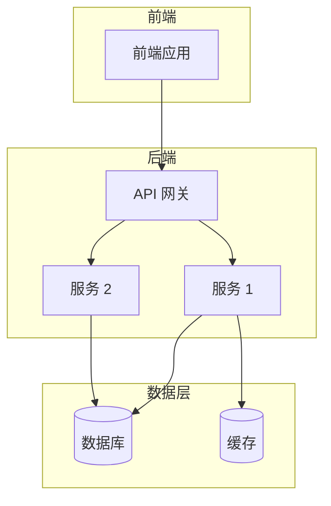
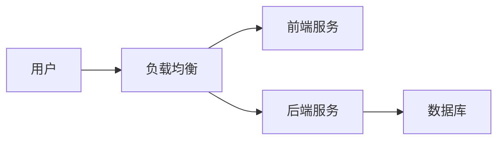

# 架构分析文档输出模板

使用以下模板生成文档：

```markdown
# {项目名称} 架构分析

> 生成时间：{timestamp}
> 分析目录：{project_path}

---

## 目录

- [项目概览](#项目概览)
- [架构分层](#架构分层)
  - [前端](#前端)
  - [后端](#后端)
  - [Infrastructure](#infrastructure)
- [模块依赖关系](#模块依赖关系)
- [数据流分析](#数据流分析)
- [技术栈总览](#技术栈总览)
- [架构图](#架构图)
- [设计模式识别](#设计模式识别)
- [潜在问题和建议](#潜在问题和建议)
- [技术债务评估](#技术债务评估)

---

## 项目概览

| 属性 | 内容 |
|------|------|
| 项目名称 | {project_name} |
| 项目类型 | {monolith | microservices | serverless | frontend-only | backend-only} |
| 主要语言 | {languages} |
| 代码行数 | ~{lines_of_code} |

## 架构分层

### 前端

**目录**: `{frontend_dir}`

**技术栈**:
- 框架: {framework}
- 状态管理: {state_management}
- 路由: {routing}
- UI 库: {ui_library}
- 构建工具: {build_tool}

**模块结构**:
```
{frontend_structure_tree}
```

**关键模块**:

| 模块 | 功能 | 文件位置 |
|------|------|----------|
| {module} | {description} | {path} |
| {module} | {description} | {path} |

### 后端

**目录**: `{backend_dir}`

**技术栈**:
- 语言: {language}
- 框架: {framework}
- 数据库: {database}
- ORM: {orm}
- 认证: {auth}

**分层架构**:
```
{backend_layer_structure}
```

**关键模块**:

| 层/模块 | 功能 | 文件位置 |
|---------|------|----------|
| {layer} | {description} | {path} |
| {layer} | {description} | {path} |

### Infrastructure

**类型**: {docker | kubernetes | terraform | serverless}

**配置文件**:
- {config_file}: {description}

**部署架构**:
```
{deployment_diagram}
```

## 模块依赖关系

### 前端模块依赖

```
{frontend_dependency_graph}
```

### 后端模块依赖

```
{backend_dependency_graph}
```

## 数据流分析

### 前端 → 后端 API

| 前端模块 | API 端点 | 后端服务 | 方法 |
|----------|----------|----------|------|
| {frontend_module} | {endpoint} | {backend_service} | {method} |

### 后端 → 数据库

| 服务/模块 | 表/集合 | 操作类型 |
|-----------|----------|----------|
| {service} | {table} | {operations} |

### 外部服务调用

| 调用方 | 外部服务 | 用途 |
|--------|----------|------|
| {caller} | {service} | {purpose} |

## 技术栈总览

| 分类 | 技术 | 版本 |
|------|------|------|
| 前端框架 | {framework} | {version} |
| 后端框架 | {framework} | {version} |
| 数据库 | {database} | {version} |
| 缓存 | {cache} | {version} |
| 消息队列 | {mq} | {version} |
| 容器 | {container} | - |
| 编排 | {orchestration} | - |

## 架构图

### 系统架构图



### 部署架构图



## 设计模式识别

| 模式 | 位置 | 说明 |
|------|------|------|
| MVC | {location} | {description} |
| Repository | {location} | {description} |
| Factory | {location} | {description} |
| Observer | {location} | {description} |

## 潜在问题和建议

### 架构问题

- [ ] {issue_1}
- [ ] {issue_2}

### 改进建议

- [ ] {suggestion_1}
- [ ] {suggestion_2}

## 技术债务评估

| 类别 | 严重程度 | 描述 |
|------|----------|------|
| {category} | {High|Medium|Low} | {description} |
| {category} | {High|Medium|Low} | {description} |

---

_此文档由 code-arch-analyzer skill 自动生成_
```
