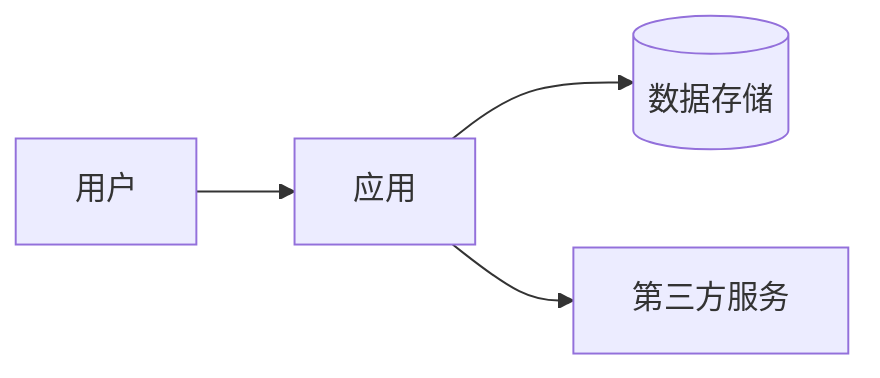

# 合规评估文档模板

## 主文档模板 (README.md)

```markdown
# {项目名称} 法律合规评估报告

> 填写日期：{date}
> 填写人：{name}
> 项目负责人：{owner}

---

## 目录

- [评估概览](#评估概览)
- [开源协议清单](#开源协议清单)
- [数据隐私合规](#数据隐私合规)
- [第三方依赖清单](#第三方依赖清单)
- [知识产权检查](#知识产权检查)
- [风险评估结论](#风险评估结论)
- [后续行动清单](#后续行动清单)

---

## 评估概览

| 项目 | 内容 |
|------|------|
| 项目名称 | {project_name} |
| 技术栈 | {tech_stack} |
| 依赖数量 | {count} 个 |
| 评估日期 | {date} |
| 评估人 | {name} |

**整体风险评级**: { □ 低 | □ 中 | □ 高 }（由法务/负责人评定）

---

## 开源协议清单

### 核心依赖

| 依赖/库 | 版本 | 协议 | 商用可用 | 风险评估 |
|---------|------|------|----------|----------|
| {填写} | {填写} | {填写} | {填写} | {填写} |
| {填写} | {填写} | {填写} | {填写} | {填写} |

### 协议说明

| 协议 | 商用 | 修改后闭源 | 修改后开源 | 备注 |
|------|------|-------------|-------------|------|
| MIT | ✅ | ✅ | - | 需保留版权声明 |
| Apache 2.0 | ✅ | ✅ | - | 需保留 NOTICE |
| BSD | ✅ | ✅ | - | - |
| LGPL | ⚠️ | ❌ | ✅ | 动态链接可闭源 |
| GPL | ⚠️ | ❌ | ✅ | 强传染，需谨慎 |
| AGPL | 🔴 | ❌ | ✅ | 网络使用也需开源 |

### 待确认事项

- [ ] {待确认的开源协议事项_1}
- [ ] {待确认的开源协议事项_2}

---

## 数据隐私合规

### 数据收集清单

| 数据类型 | 是否收集 | 收集目的 | 法律依据 | 用户同意 |
|----------|----------|----------|----------|----------|
| 用户账号 | {是/否} | {填写} | {填写} | {是/否} |
| 个人身份信息 | {是/否} | {填写} | {填写} | {是/否} |
| 敏感数据（人脸/指纹） | {是/否} | {填写} | {填写} | {是/否} |
| 设备信息 | {是/否} | {填写} | {填写} | {是/否} |
| 行为数据 | {是/否} | {填写} | {填写} | {是/否} |

### 法律要求对照

#### 《个人信息保护法》

- [ ] 是否制定隐私政策？
- [ ] 是否获得用户明确同意？
- [ ] 是否告知数据用途？
- [ ] 是否提供撤回同意的方式？
- [ ] 数据是否分类分级？

#### 《数据安全法》

- [ ] 是否开展数据安全评估？
- [ ] 是否采取数据安全措施？
- [ ] 数据出境是否经过安全评估？

#### 《网络安全法》

- [ ] 是否通过等级保护认证？
- [ ] 是否开展网络安全检测？

#### 其他地区（如适用）

- [ ] GDPR（欧盟）
- [ ] CCPA（加州）

### 合规文件状态

- [ ] 隐私政策 {状态：未制定/草稿/已发布}
- [ ] 用户协议 {状态：未制定/草稿/已发布}
- [ ] Cookie 政策 {状态：不适用/草稿/已发布}
- [ ] 数据处理协议 (DPA) {状态：不适用/草稿/已签署}

---

## 第三方依赖清单

### 第三方 SDK/服务

| 服务/SDK | 提供方 | 用途 | 数据处理 | 协议 | 风险 |
|----------|--------|------|----------|------|------|
| {填写} | {填写} | {填写} | {填写} | {填写} | {填写} |
| {填写} | {填写} | {填写} | {填写} | {填写} | {填写} |

### 安全漏洞检查

| 依赖 | CVE 编号 | 风险等级 | 修复状态 |
|------|----------|----------|----------|
| {填写} | {填写} | {填写} | {填写} |
| {填写} | {填写} | {填写} | {填写} |

---

## 知识产权检查

### 商标检查

| 检查项 | 状态 | 备注 |
|--------|------|------|
| 项目名称是否可用 | {待检查} | {备注} |
| Logo 是否原创或有授权 | {待检查} | {备注} |
| 域名是否可注册 | {待检查} | {备注} |

### 专利风险

| 技术点 | 专利检索结果 | 风险评估 |
|--------|--------------|----------|
| {核心技术_1} | {待检索} | {待评估} |
| {核心技术_2} | {待检索} | {待评估} |

### 著作权检查

- **代码来源**: {自研/开源/外包/ -}
- **图片/图标**: {原创/授权/免费商用/ -}
- **字体**: {商业授权/免费商用/需授权/ -}
- **音视频**: {原创/授权/免费商用/ -}
- **模板/框架**: {填写具体信息}

---

## 风险评估结论

### 风险汇总

| 维度 | 风险等级 | 说明 |
|------|----------|------|
| 开源协议 | {待评定} | {说明} |
| 数据隐私 | {待评定} | {说明} |
| 第三方依赖 | {待评定} | {说明} |
| 知识产权 | {待评定} | {说明} |

### 必须处理事项

- [ ] {必须处理的事项_1}
- [ ] {必须处理的事项_2}

### 建议处理事项

- [ ] {建议处理的事项_1}
- [ ] {建议处理的事项_2}

---

## 后续行动清单

### 文档准备

- [ ] 制定/完善隐私政策
- [ ] 制定/完善用户协议
- [ ] 准备数据处理协议（如适用）

### 技术措施

- [ ] {技术措施_1}
- [ ] {技术措施_2}

### 法律咨询

- [ ] {需要咨询的法律问题_1}
- [ ] {需要咨询的法律问题_2}

### 时间计划

| 事项 | 负责人 | 预计完成时间 | 状态 |
|------|--------|--------------|------|
| {行动_1} | {填写} | {填写} | {待开始/进行中/已完成} |
| {行动_2} | {填写} | {填写} | {待开始/进行中/已完成} |

---

## 免责声明

> 本文档为合规性评估模板，供项目团队自查使用。填写后的内容请咨询专业律师进行最终审核。
>
> 填写人应对填写内容的真实性和准确性负责。

---

_文档由 compliance-check skill 生成，内容由{填写人}填写_
```

## 子文档模板

### open-source.md - 开源协议清单

```markdown
# 开源协议清单

> {项目名称}

---

## 协议汇总

| 协议类型 | 数量 | 商用友好 | 说明 |
|----------|------|----------|------|
| MIT | {count} | ✅ | 最宽松 |
| Apache 2.0 | {count} | ✅ | 含专利授权 |
| BSD | {count} | ✅ | 类似 MIT |
| LGPL | {count} | ⚠️ | 弱传染 |
| GPL/AGPL | {count} | 🔴 | 强传染 |
| Other | {count} | ⚠️ | 需确认 |

## 详细列表

{依赖详细列表}

## 风险提示

{风险提示说明}
```

### data-privacy.md - 数据隐私合规

```markdown
# 数据隐私合规

> {项目名称}

---

## 数据流程图



## 数据收集

{数据收集详情}

## 合规要求

{法律要求对照}
```
