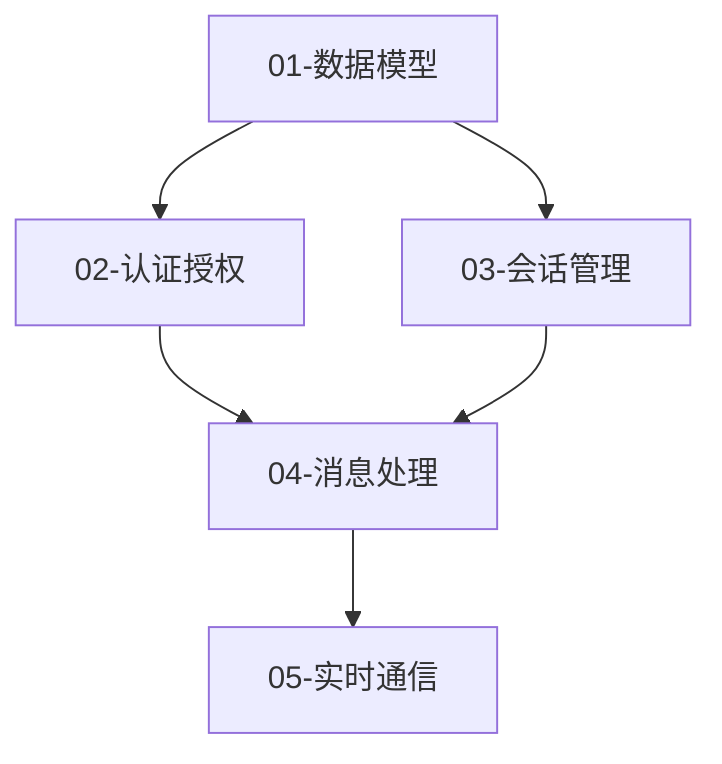

# 开发规划输出模板

## README.md（开发计划总览）

```markdown
# [项目名称] 开发模块规划

## 目录

- [项目概述](#项目概述)
- [技术栈](#技术栈)
- [开发模块总览](#开发模块总览)
- [模块依赖关系](#模块依赖关系)
- [开发流程](#开发流程)
- [开发规范](#开发规范)
- [快速开始](#快速开始)

---

## 项目概述

[项目简介]

## 技术栈

| 层级 | 技术选型 |
|------|----------|
| 前端 | ... |
| 后端 | ... |
| 基础设施 | ... |

## 开发模块总览

| 序号 | 模块名称 | 类型 | 优先级 | 预估工时 | 状态 |
|------|---------|------|--------|----------|------|
| 01 | xxx | 基础 | P0 | 2天 | 待开发 |
| 02 | xxx | 核心 | P0 | 3天 | 待开发 |

## 模块依赖关系

[Mermaid 依赖图]

## 开发流程

### 个人开发者推荐流程

```
1️⃣ Phase 1: 数据库设计
   ├── 完成所有数据模型定义
   ├── 执行数据库迁移
   └── 验证数据库结构

2️⃣ Phase 2: 后端 API 开发
   ├── 按模块顺序开发所有后端 API
   ├── 每个模块完成后编写单元测试
   └── 更新 checklist

3️⃣ Phase 3: 后端集成测试 ⚠️ 关键阶段
   ├── 运行所有后端单元测试
   ├── 运行 API 集成测试
   ├── 确保所有 API 测试通过 ✅
   └── 修复所有发现的问题

4️⃣ Phase 4: 前端开发
   ├── 基于已稳定的 API 开发前端
   ├── 逐个实现页面和组件
   └── 前后端联调测试
```

### 团队协作流程

1. 按照模块序号顺序开发
2. 每个模块开发完成后：
   - 运行单元测试
   - 运行集成测试
   - 更新 checklist
   - 提交代码
3. 完成一个模块后，标记为已完成

## 开发规范

- [ ] 遵循项目代码规范
- [ ] 编写单元测试（覆盖率 > 80%）
- [ ] 编写 API 文档
- [ ] 通过代码审查
- [ ] 更新 README

## 快速开始

参见 [modules.md](modules.md) 获取模块列表和详细说明。
```

## modules.md（模块列表和依赖）

```markdown
# 模块列表

## 模块依赖图



## 模块列表

### 01-数据模型模块
**类型**: 基础 | **优先级**: P0 | **预估**: 2天

**职责**:
- 定义数据模型（Prisma Schema）
- 数据库迁移
- 基础 CRUD 操作

**依赖**: 无

**产出**:
- Prisma Schema
- 数据库迁移文件
- 基础 Repository

**详细文档**: [modules/01-数据模型.md](modules/01-数据模型.md)

---

### 02-认证授权模块
**类型**: 基础 | **优先级**: P0 | **预估**: 3天

**职责**:
- 用户注册/登录
- JWT Token 生成和验证
- 权限控制

**依赖**: 01-数据模型

**产出**:
- 认证 API
- JWT 工具
- 权限中间件

**详细文档**: [modules/02-认证授权.md](modules/02-认证授权.md)

---

（每个模块的简要说明）
```

## checklist.md（开发进度检查清单）

```markdown
# 开发进度检查清单

## Phase 1: 数据库设计

- [ ] 01-数据模型
  - [ ] 定义 Prisma Schema
  - [ ] 创建数据库迁移
  - [ ] 编写基础 Repository
  - [ ] 验证数据库结构

## Phase 2: 后端 API 开发

- [ ] 02-认证授权
  - [ ] 实现注册/登录 API
  - [ ] 实现 JWT 工具
  - [ ] 实现权限中间件
  - [ ] 单元测试通过

- [ ] 03-核心业务模块 A
  - [ ] 实现 CRUD API
  - [ ] 业务逻辑完成
  - [ ] 单元测试通过

- [ ] 04-核心业务模块 B
  - [ ] 实现 CRUD API
  - [ ] 业务逻辑完成
  - [ ] 单元测试通过

## Phase 3: 后端集成测试 ⚠️ 必须全部通过

- [ ] 所有后端单元测试
- [ ] 所有 API 集成测试
- [ ] 性能测试
- [ ] 安全测试
- [ ] **✅ 后端测试全部通过后，再进入 Phase 4**

## Phase 4: 前端开发

- [ ] 10-前端基础配置
  - [ ] 项目初始化
  - [ ] 状态管理配置
  - [ ] 路由配置
  - [ ] API 对接层

- [ ] 11-页面组件 A
  - [ ] UI 组件完成
  - [ ] API 对接完成
  - [ ] 交互测试通过

- [ ] XX-Analytics 分析模块（Phase 4 末尾，依赖认证模块）
  - [ ] 安装 `posthog-js`，配置环境变量（GA_MEASUREMENT_ID / POSTHOG_KEY / POSTHOG_HOST）
  - [ ] 创建 `lib/utm.ts`（UTM 捕获 + direct/organic/referral fallback）
  - [ ] 创建 `lib/analytics.ts`（trackEvent / identifyUser / trackPageView）
  - [ ] 在 `app/layout.tsx` 挂载 GA4 Script + 初始化 PostHog + captureUTM
  - [ ] 创建 `user_utm` Supabase 表并在注册时写入
  - [ ] 在认证模块注册成功处调用 `identifyUser()` + `saveUserUTM()`
  - [ ] 按事件清单在各模块埋点 `trackEvent()`
  - [ ] **验证**：PostHog Events 页面收到 `$pageview` + 业务事件

## 进度统计

| Phase | 状态 | 完成度 |
|-------|------|--------|
| Phase 1: 数据库 | ⬜ 进行中 | 0% |
| Phase 2: 后端 API | ⬜ 待开始 | 0% |
| Phase 3: 后端测试 | ⬜ 待开始 | 0% |
| Phase 4: 前端 | ⬜ 待开始 | 0% |

**总体进度**: 0 / 10 模块完成
```

## 单个模块文档模板

```markdown
# [序号]-[模块名称]

## 模块概述

**模块类型**: 基础/核心/业务/接口
**优先级**: P0/P1/P2
**预估工时**: X 天
**状态**: 待开发/进行中/已完成

## 功能需求

### 用户故事
```
作为 [角色]
我希望 [功能]
以便 [价值]
```

### 功能清单
- [ ] 功能点 1
- [ ] 功能点 2
- [ ] 功能点 3

## 技术实现

### 数据模型
```prisma
// Prisma Schema
model Example {
  id String @id @default(uuid())
  // ...
}
```

### API 设计
```http
POST /api/examples
GET /api/examples/:id
PUT /api/examples/:id
DELETE /api/examples/:id
```

### 核心代码结构
```
src/modules/example/
├── example.routes.ts
├── example.controller.ts
├── example.service.ts
├── example.repository.ts
├── example.schema.ts
└── example.spec.ts
```

### 关键实现
```typescript
// 核心代码示例
export class ExampleService {
  async create(data: CreateExampleDto) {
    // 实现
  }
}
```

## 测试方案

### 单元测试
```typescript
describe('ExampleService', () => {
  it('should create example', async () => {
    // 测试用例
  });
});
```

### 集成测试
```typescript
describe('Example API', () => {
  it('POST /api/examples should create', async () => {
    // 测试用例
  });
});
```

### 测试覆盖
- [ ] 正常场景
- [ ] 边界条件
- [ ] 异常处理
- [ ] 并发场景

## 开发步骤

### Step 1: 数据层（0.5天）
- [ ] 定义 Prisma Schema
- [ ] 创建迁移
- [ ] 实现 Repository

### Step 2: 服务层（1天）
- [ ] 实现业务逻辑
- [ ] 实现验证
- [ ] 编写单元测试

### Step 3: 接口层（0.5天）
- [ ] 实现 API 路由
- [ ] 实现中间件
- [ ] 编写集成测试

### Step 4: 文档和验收（0.5天）
- [ ] 更新 API 文档
- [ ] 代码审查
- [ ] 验收测试

## 验收标准

### 功能验收
- [ ] 所有功能正常工作
- [ ] API 响应符合规范
- [ ] 错误处理完善

### 质量验收
- [ ] 单元测试覆盖率 > 80%
- [ ] 所有测试通过
- [ ] 代码审查通过
- [ ] 无已知 Bug

### 性能验收
- [ ] API 响应时间 < 100ms (P95)
- [ ] 数据库查询优化
- [ ] 无明显性能问题

## 依赖模块

- `01-数据模型`（必须先完成）

## 被依赖模块

- `03-会话管理`（依赖本模块）

## 注意事项

1. 确保数据库迁移正确执行
2. 注意并发安全问题
3. 错误日志要完善

## 参考文档

- [API 设计规范](../../TechSolution/backend/api-design.md)
- [开发规范](../../TechSolution/backend/dev-guide.md)
```
