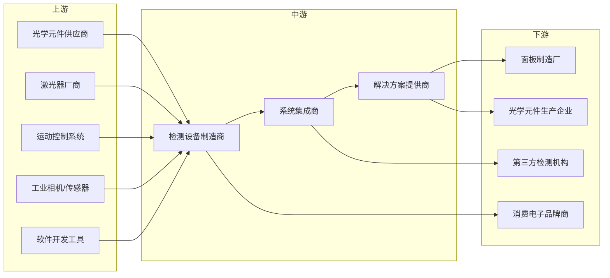
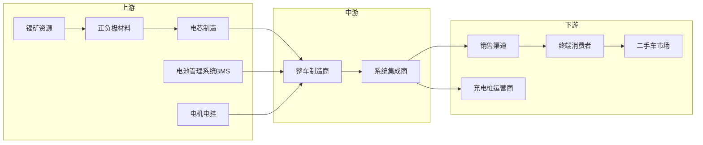
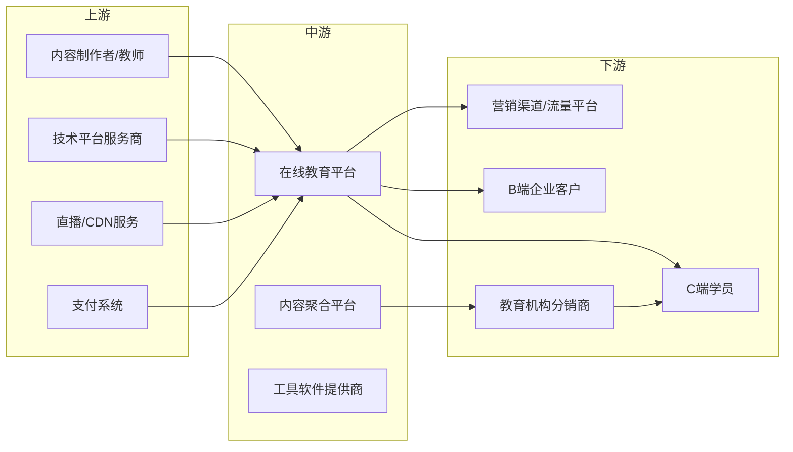
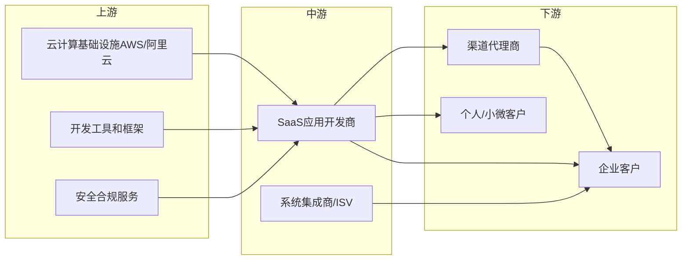

# 市场研究分析框架

## 行业分析维度

### 1. 市场规模与增长
- 当前市场规模 (TAM/SAM/SOM)
- 历史增长率 (过去3-5年)
- 未来增长预测 (未来3-5年)
- 驱动增长的关键因素

### 2. 产业链结构与行业全景

#### 2.1 产业链全景图 (Industry Chain Map)

产业链分析是理解行业的核心。必须清晰绘制上游、中游、下游的完整结构。

**上游 (Upstream)**
- 原材料供应商
- 核心技术/设备提供商
- 基础服务提供商
- 关键资源控制者
- 分析要点：
  - 供应商集中度（是否被少数企业垄断）
  - 议价能力
  - 技术壁垒
  - 国产化/进口依赖程度

**中游 (Midstream)**
- 产品制造商/服务提供商
- 品牌商
- 系统集成商
- 解决方案提供商
- 分析要点：
  - 竞争格局（集中度CR3/CR5）
  - 核心竞争力（技术/品牌/渠道/规模）
  - 盈利模式
  - 行业地位变化

**下游 (Downstream)**
- 渠道/分销商
- 终端客户（B端/C端/G端）
- 售后服务商
- 分析要点：
  - 客户集中度
  - 需求特征
  - 付费能力
  - 增长潜力

**产业链价值分布**
- 各环节毛利率对比
- 利润池分布
- 价值转移趋势
- 议价能力变化

**示例：光学检测设备产业链**

**价值分布分析**:
- 上游（30%）：核心元件（如激光器、高精度传感器）利润率高，技术壁垒强
- 中游（50%）：系统集成和定制化方案是主要利润来源
- 下游（20%）：渠道和服务，利润相对较薄

#### 2.4 绘制产业链图的方法论

**Step 1: 识别产业链边界**
- 从终端产品/服务倒推
- 确定"最上游"（原材料/基础设施）
- 确定"最下游"（最终用户）

**Step 2: 划分层级**
- 上游：原材料、核心技术、基础设施
- 中游：制造/服务提供、品牌、集成
- 下游：渠道、终端客户、售后服务

**Step 3: 列举关键参与者**
- 每个层级至少3-5个代表性角色
- 标注头部企业名称（如果已知）
- 注明市场份额（如果有数据）

**Step 4: 标注价值流向**
- 物流方向（产品/服务流向）
- 资金流向（支付方向）
- 信息流向（数据/指令流向）

**Step 5: 分析关键环节**
- 哪个环节利润率最高？
- 哪个环节壁垒最高？
- 哪个环节话语权最强？
- 哪个环节最分散/集中？

#### 2.5 更多产业链示例

**示例 2: 新能源汽车产业链**

**价值分布**: 上游电池占成本40%，中游整车品牌溢价30%，下游渠道10%

**示例 3: 在线教育产业链**

**价值分布**: 上游内容创作20%，中游平台运营40%，下游营销获客40%

**示例 4: SaaS软件产业链（简化版）**

**价值分布**: 上游基础设施15%，中游SaaS应用60%，下游渠道服务25%

#### 2.2 细分市场/赛道
- 按应用场景细分
- 按客户类型细分
- 按价格区间细分
- 按技术路线细分

#### 2.3 进入壁垒与退出成本
- 技术壁垒
- 资金壁垒
- 品牌壁垒
- 渠道壁垒
- 政策/牌照壁垒

### 3. 竞争格局
- 市场集中度 (CR3/CR5)
- 主要玩家定位
- 竞争强度 (Porter's 5 Forces)
- 差异化因素

### 4. 用户画像
- 目标客户群体特征
- 核心需求与痛点
- 购买决策路径
- 付费意愿与能力

### 5. 商业模式
- 主流变现方式
- 定价策略
- 成本结构
- 单位经济模型

### 6. 技术趋势
- 颠覆性技术
- 技术成熟度曲线
- 技术壁垒
- 未来技术方向

### 7. 政策环境
- 监管政策
- 行业标准
- 政府扶持政策
- 合规要求

## 赚钱机会识别框架

### 创业机会
1. **市场空白点**
   - 未被满足的需求
   - 服务不足的细分市场
   - 新兴用户群体

2. **效率提升机会**
   - 流程优化空间
   - 成本降低潜力
   - 技术替代方案

3. **体验升级机会**
   - 用户体验痛点
   - 服务质量提升空间
   - 个性化需求

4. **模式创新机会**
   - 新商业模式
   - 跨界整合
   - 平台化机会

### 投资机会
1. **高增长赛道**
   - CAGR > 20%的细分领域
   - 政策扶持方向
   - 技术驱动增长

2. **头部公司**
   - 市场份额领先
   - 护城河深厚
   - 盈利能力强

3. **潜力新星**
   - 创新商业模式
   - 差异化竞争力
   - 快速增长潜力

### 副业/自由职业机会
1. **低门槛入口**
   - 所需初始资本
   - 技能要求
   - 时间投入

2. **快速变现**
   - 回报周期
   - 稳定性
   - 扩展性

3. **个人品牌**
   - 专业服务
   - 内容创作
   - 咨询培训

## 机会评估矩阵

每个识别的机会应从以下维度评分 (1-5分):

| 维度 | 权重 | 评估标准 |
|------|------|----------|
| 市场规模 | 20% | 可触达市场大小 |
| 增长潜力 | 20% | 未来3年CAGR |
| 竞争强度 | 15% | 现有竞争者数量和强度 |
| 进入门槛 | 15% | 资金/技术/资源要求 |
| 变现能力 | 15% | 单位经济模型健康度 |
| 执行难度 | 10% | 实施复杂度 |
| 风险程度 | 5% | 政策/技术/市场风险 |

综合得分 = Σ(维度得分 × 权重)

高优先级机会: 得分 > 3.5
中优先级机会: 2.5 < 得分 ≤ 3.5
低优先级机会: 得分 ≤ 2.5

## 输出结构参考

### 行业概览 (Industry Overview)
- 行业定义与范围
- 市场规模与增长
- 产业链结构
- 关键成功因素

### 竞争格局 (Competitive Landscape)
- 市场集中度
- 主要玩家分析 (Top 5-10)
- 竞争维度
- 差异化策略

### 用户洞察 (Customer Insights)
- 目标客户画像
- 核心需求与痛点
- 购买行为
- 未满足需求

### 商业模式 (Business Models)
- 主流变现方式
- 定价策略
- 成本结构
- 单位经济模型

### 趋势与变化 (Trends & Changes)
- 技术趋势
- 消费趋势
- 政策变化
- 新兴机会

### 赚钱机会清单 (Money-Making Opportunities)
每个机会包含:
- 机会描述
- 目标市场
- 商业模式
- 初始投入
- 预期回报
- 风险评估
- 执行路径
- 优先级评分

### 行动建议 (Action Plan)
- 推荐机会 (Top 3)
- 下一步行动
- 资源需求
- 时间规划
